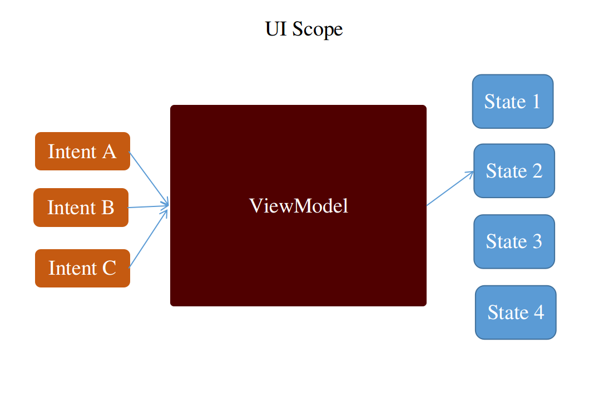

## [UIScopes](../../../bitframe-sdk/client/core/src/commonMain/kotlin/bitframe/client/UIScope.kt)

### Introduction


A UIScope is very synonymous to a screen, but it has much more going on than just a screen. A Scope has an underlying viewmodel which acts as a finite state machine for that particular scope.

Once invoked, the intents are fed into the viewmodel, which then digest and spits our the respective state as an outcome to that intent

### Components of a UIScope

A basic UIScope has three components. These are:-

- #### ViewModel
  Every [UIScope](../../../bitframe-sdk/client/core/src/commonMain/kotlin/bitframe/client/UIScope.kt) must have exactly one ViewModel which manages the state. It accomplishes that by translating what
  you do (sending intents), into what you want to show (spitting out states). Normally, you wouldn't directly interact with it, but you will experience its effect while consuming the controlled state.

  ```typescript
  const state = useViewModelState(viewModel)
  ```
  A viewmodel is primarily responsible for
    - Consuming intents
    - Parsing data to the underlying api
    - Spitting out the most convenient state from the api
    - Handling user errors and api errors all together

- #### States
  Are models of presentation to a particular screen. These state are very specific to each screen, and they come with enough data embedded with an opinion of what should be displayed. Each UIScope
  will have an exact documentation of all possible states, and the combining properties that comes with them

  One of the most common (but not always the case) state, is the Failure state. This state is delivered after the viewmodel has finished handling error cases.

- #### Intents
  Are list of actions that one can perform while in a specific scope. Every scope has different intents and will be documented

### Components of a ReactUIScope

Since we are heavily using react, all of our scopes are extended to be easily usable from react, and would come with an extra component that is very react specific

- #### Hooks
  These are scope specific hooks that will make it easy to listen to specific events relatively to the calling scope 